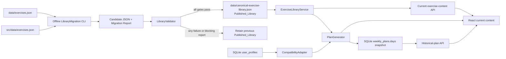

# Technical Design: Exercise Library Unification

## Overview

This design replaces the two independently consumed legacy exercise files with one published, versioned JSON library at `data/canonical-exercise-library.json`. It introduces deterministic server-side validation, migration, normalization, safety filtering, eligibility assessment, and alternative selection. The React client no longer imports exercise JSON for current content or plan generation; it receives compatibility-shaped content from Express. SQLite remains the store for profiles, plans, and training records, not the exercise library.

The design deliberately treats structured library fields as the sole source of safety and eligibility truth. `warning`, `tips`, `steps`, and any LLM-generated text are display-only. A record passing every validator rule is automatically assigned `approved`; there is no reviewer workflow or manual publish action. Any unrecognized profile value, invalid library candidate, unresolved migration issue, or requested project without a fully eligible candidate produces the structured `temporarily_unavailable` result with display text `暂不可生成`. It never falls back to an unsafe, unapproved, text-overridden, or otherwise unqualified exercise.

### Design decisions

| Decision | Rationale |
| --- | --- |
| Store the one runtime-published library in `data/canonical-exercise-library.json`. | It is the only exercise-data path read by runtime services and can be shared by server scripts without bundling a second source into the React application. |
| Make Express the sole reader of current exercise data. | This removes the current direct React import of `src/data/exercises.json` and guarantees plans and exercise-content endpoints observe the same published version. |
| Validate on every load and only cache an all-valid published library. | Prevents invalid structured data from silently entering plan selection while retaining a small, local-only implementation. |
| Keep candidate files and reports as non-runtime artifacts under `data/.exercise-library-candidates/` and `data/exercise-library-reports/`. | A candidate can be evaluated without replacing the sole published source; supported consumers never read these artifacts. |
| Preserve `weekly_plans.days` as immutable exercise snapshots. | Existing SQLite plans already embed the rendered exercise object; returning that JSON unchanged preserves historical readability after deprecation or replacement. |
| Return an HTTP 200 discriminated generation result for `temporarily_unavailable`. | It makes availability a normal, explicitly handled product outcome rather than a generic transport failure and avoids the current API helper discarding its structured body. |

### Research findings informing the design

Repository inspection established the following constraints, which the design addresses without external services or RAG:

- `server/src/routes/plans.ts` and `server/src/routes/projects.ts` both load `src/data/exercises.json`, while `src/lib/planGenerator.ts` and `src/pages/ExerciseDetailPage.tsx` import the same file in the browser. All four reads must be retired for newly generated or current content.
- Current injury filtering inspects Chinese text in `warning`; it is replaced by the closed injury vocabulary and structured `contraindications` comparison.
- `user_profiles` stores `experience`, `injuries`, `equipment`, and `selected_projects` as SQLite text/JSON values, so normalization belongs at an explicit compatibility boundary before eligibility evaluation.
- `weekly_plans.days` is already a serialized full plan; it is the historical snapshot contract and requires no dependency on the current library when read.
- Neither package defines a test runner or property-testing dependency today. The implementation adds pinned development dependencies only for test tooling, with `fast-check` selected for pure TypeScript library logic.

## Architecture



### Publication lifecycle

1. `LibraryMigration` reads both legacy files in a fixed source-path and source-index order, emits one report entry per input record, and creates a candidate JSON document.
2. The validator normalizes no data implicitly: it validates the candidate’s schema, closed vocabularies, record uniqueness, alternative references, safety fields, and migration blockers.
3. For each record, the validation result determines status: not-yet-evaluated is `draft`; any failure is `needs_review`; all rules passing is automatically `approved`; retained historical records may be explicitly `deprecated`.
4. The candidate can atomically replace the published path only when every record and publication gate passes and the migration report has no unresolved or unselected conflict. No person approves it.
5. Runtime `ExerciseLibraryService` accepts only the published path. If the file is invalid at reload, it keeps the last successfully loaded immutable in-memory version; an initial-load failure makes current content and new generation return a request error rather than reading legacy data.

### Request paths

```mermaid
sequenceDiagram
  participant UI as React client
  participant API as Express route
  participant CA as CompatibilityAdapter
  participant LS as ExerciseLibraryService
  participant PG as PlanGenerator
  participant DB as SQLite

  UI->>API: POST /api/plans/generate
  API->>DB: load profile
  API->>CA: normalize legacy profile values
  CA-->>API: normalized profile or unavailable
  API->>LS: get Published_Library
  LS-->>API: immutable approved library
  API->>PG: generate(requested projects, profile, library)
  PG-->>API: PlanGenerationSuccess or StructuredUnavailableResult
  alt success
    API->>DB: save full exercise snapshots in weekly_plans.days
    API-->>UI: plan snapshot
  else unavailable
    API-->>UI: outcome=temporarily_unavailable; no write
  end
```

## Components and Interfaces

### Canonical files and shared server module layout

| Location | Responsibility |
| --- | --- |
| `data/canonical-exercise-library.json` | The only published runtime JSON library. Contains library metadata, controlled vocabularies, and canonical exercise records. |
| `data/.exercise-library-candidates/<candidate-id>.json` | Offline, unserved migration/edit candidate; may never be read by a runtime route. |
| `data/exercise-library-reports/<candidate-id>.migration.json` | Machine-readable migration result retained as publication evidence. |
| `data/exercise-library-reports/<candidate-id>.validation.json` | Machine-readable validation results and publication-gate outcome. |
| `server/src/exercise-library/types.ts` | TypeScript types for canonical data, validation, migration, compatibility, and API discriminated unions. |
| `server/src/exercise-library/vocabulary.ts` | Closed constant sets and exact injury expansion mapping. |
| `server/src/exercise-library/validator.ts` | Pure `validateLibrary(candidate, migrationReport)` implementation. |
| `server/src/exercise-library/migrate.ts` | Offline CLI conversion/reconciliation of both legacy sources. |
| `server/src/exercise-library/service.ts` | Published-file loading, validation, immutable caching, current-content lookup, and explicit reload. |
| `server/src/exercise-library/compatibility.ts` | Profile normalization and canonical-to-current-client display adapter. |
| `server/src/exercise-library/eligibility.ts` | Pure assessment and stable alternative-selection logic. |
| `server/src/routes/plans.ts` | Uses the service/generator only; never imports a legacy exercise file or warning-text matcher. |
| `server/src/routes/projects.ts` and new `server/src/routes/exercises.ts` | Expose only current content derived from the published library. |

### Core interfaces

```ts
type InjurySelection = 'shoulder' | 'neck' | 'elbow' | 'wrist' | 'back' | 'knee';
type InjuryTag =
  | 'shoulder_impingement' | 'rotator_cuff' | 'neck_pain'
  | 'elbow_pain' | 'wrist_pain' | 'lower_back' | 'sciatica'
  | 'knee_pain' | 'meniscus';
type ProjectId =
  | 'tricep_tone' | 'hip_thigh_tone' | 'lower_abs_tone'
  | 'trap_relax' | 'round_shoulder_fix' | 'full_body_basic';
type ExerciseCategory = 'strength' | 'warmup' | 'stretch' | 'cardio';
type ReviewStatus = 'draft' | 'needs_review' | 'approved' | 'deprecated';
type TrainingExperience = 'zero' | 'occasional' | 'regular';
type EligibilityCategory =
  | 'project' | 'review_status' | 'safety' | 'equipment' | 'experience' | 'alternative';
type Outcome = 'passed' | 'failed' | 'not_applicable';

interface CanonicalExercise {
  exercise_id: string;
  name: string;
  name_en: string;
  muscle_group: { primary: string[]; secondary: string[] };
  difficulty: 1 | 2 | 3 | 4 | 5;
  equipment: string[];
  function: { primary: string; secondary: string };
  category: ExerciseCategory;
  target_projects: ProjectId[];
  contraindications: InjuryTag[];
  alternative_exercise_ids: string[];
  review_status: ReviewStatus;
  rest_seconds: number;
  steps: string[];
  tips: string[];
  warning: string;
}

interface CanonicalExerciseLibrary {
  library_id: string;
  library_version: string;
  registry_version: string;
  published_at: string;
  controlled_vocabularies: { equipment_ids: string[]; muscle_groups: string[] };
  exercises: CanonicalExercise[];
}

interface CategoryAssessment {
  category: EligibilityCategory;
  outcome: Outcome;
  reasons: Array<{ code: string; value: string | string[] | number }>;
}
interface EligibilityAssessment {
  exercise_id: string;
  project_id: ProjectId;
  categories: CategoryAssessment[];
  eligible: boolean;
  alternative_selection?: {
    replaced_exercise_id: string;
    selected_exercise_id: string;
    alternative_index: number;
    reason: 'first_eligible_referenced_alternative';
  };
}

interface StructuredUnavailableResult {
  outcome: 'temporarily_unavailable';
  display_message: '暂不可生成';
  requested_project_ids: string[];
  failed_eligibility_categories_by_project: Record<string, EligibilityCategory[]>;
  unknown_input_values: Array<{ field: 'injuries' | 'equipment' | 'experience' | 'selected_projects'; value: string }>;
  experience: string | null;
}
```

### Validator and migration interfaces

```ts
interface ValidationResult {
  exercise_id: string | null;
  rule: string;
  field: string;
  invalid_value: unknown;
  outcome: 'passed' | 'failed';
  registry_version: string;
}
interface LibraryValidationReport {
  candidate_id: string;
  registry_version: string;
  allowed_equipment_ids: string[];
  allowed_muscle_groups: string[];
  results: ValidationResult[];
  blocking_migration_entries: MigrationRecordOutcome[];
  publication_gate: 'passed' | 'failed';
}
interface MigrationRecordOutcome {
  source_path: 'data/exercises.json' | 'src/data/exercises.json';
  source_index: number;
  legacy_record_identifier: string | null;
  outcome: 'migrated' | 'merged' | 'unresolved';
  canonical_exercise_id: string | null;
  unresolved_fields: Array<{ field: string; source_value: unknown }>;
  selected_values: Record<string, unknown>;
  conflicts: Array<{ field: string; values_by_source: Record<string, unknown>; selected_value?: unknown }>;
}
interface MigrationReport {
  candidate_id: string;
  source_record_counts: Record<string, number>;
  outcomes: MigrationRecordOutcome[];
  blocking: boolean;
}
```

`validateLibrary` is pure and always returns all findings rather than failing fast. It verifies required fields, JSON types, non-empty strings, integer ranges, array cardinality/uniqueness, closed values, duplicate IDs, unique non-self alternative IDs, alternative target existence, and that referenced alternatives are `approved`. It emits validation evidence for every evaluated record and a summary that includes exact active registry arrays whenever the registry changes.

`migrateExerciseLibrary` is also deterministic: inputs are parsed in declared source order; source records are ordered by their original array order, and collisions use an explicit `canonicalKey` mapping table. Automatic merging is permitted only when every conflicting field has an explicitly selected canonical value in the report. Otherwise the target record and source outcome remain `needs_review`/`unresolved`, blocking publication.

### Compatibility adapter and plan generator

`normalizeProfile(rawProfile)` converts accepted legacy values to controlled values before selection. It uses versioned, explicit lookup maps, for example `none -> bodyweight` and a documented legacy injury spelling -> one `InjurySelection`. It returns unmatched inputs rather than guessing. Unknown injury or experience ends the complete request immediately as `StructuredUnavailableResult`; unmatched equipment is returned in `unknown_input_values`/compatibility diagnostics and cannot satisfy equipment eligibility. Selected projects are checked against the closed `ProjectId` set.

`assessEligibility(exercise, projectId, profile)` produces all six category entries in stable category order. `project`, `review_status`, `safety`, `equipment`, and `experience` are applicable for an initial exercise; `alternative` is `not_applicable` until replacement is attempted. Safety expands the normalized injury selections exactly:

```ts
const INJURY_EXPANSION: Record<InjurySelection, InjuryTag[]> = {
  shoulder: ['shoulder_impingement', 'rotator_cuff'],
  neck: ['neck_pain'],
  elbow: ['elbow_pain'],
  wrist: ['wrist_pain'],
  back: ['lower_back', 'sciatica'],
  knee: ['knee_pain', 'meniscus'],
};
const EXPERIENCE_RANGE: Record<TrainingExperience, readonly [number, number]> = {
  zero: [1, 2], occasional: [2, 3], regular: [3, 4],
};
```

No injuries passes safety regardless of record contraindications. Otherwise a safety failure reports every intersection of `contraindications` and the expanded union. Equipment passes if and only if the exercise contains `bodyweight` or intersects the normalized user equipment set. Review status passes only for `approved`. An exercise is an `Eligibility_Candidate` only if all applicable categories pass.

`selectQualifiedExercise` first assesses the requested record. If it is ineligible and has references, it assesses the referenced records in stored array order and returns the first fully eligible one, including the replacement log. It does not search the library for any other substitute. If no referenced alternative qualifies, its `alternative` category fails and the project has no candidate. For each request, the generator evaluates every requested project; if any project has no candidate, it returns exactly one structured unavailable result, selects nothing, and writes no plan.

## Data Models

### Published JSON shape

```json
{
  "library_id": "flourish-exercises",
  "library_version": "2026-03-20.1",
  "registry_version": "1",
  "published_at": "2026-03-20T00:00:00.000Z",
  "controlled_vocabularies": {
    "equipment_ids": ["bodyweight", "band_light", "band_mid", "dumbbell_1kg", "mat_6mm"],
    "muscle_groups": ["肱三头肌", "前臂", "臀大肌", "腹横肌"]
  },
  "exercises": [
    {
      "exercise_id": "wall_pushup",
      "name": "墙面俯卧撑",
      "name_en": "Wall Push-up",
      "muscle_group": { "primary": ["肱三头肌"], "secondary": ["胸大肌"] },
      "difficulty": 1,
      "equipment": ["bodyweight"],
      "function": { "primary": "紧致", "secondary": "激活" },
      "category": "strength",
      "target_projects": ["tricep_tone"],
      "contraindications": ["wrist_pain", "shoulder_impingement"],
      "alternative_exercise_ids": [],
      "review_status": "approved",
      "rest_seconds": 45,
      "steps": ["面对墙站立", "屈肘靠近墙面", "推回起始位置"],
      "tips": ["收紧核心"],
      "warning": "疼痛即停止。"
    }
  ]
}
```

The arrays in `controlled_vocabularies` are exact registry data, not UI labels. The server may provide a separate presentation-label map, but labels cannot be used as eligibility identifiers. The library retains a deprecated canonical record so a stored snapshot’s semantic identity can be documented even though no new plan can select it.

### Plan snapshot and adapter model

A successful generation writes the already adapted, self-contained snapshot to `weekly_plans.days`. Each selected exercise includes the stable canonical identity and the existing client fields:

```ts
interface ClientExerciseSnapshot {
  id: string;                 // canonical exercise_id
  name: string;
  category: 'warmup' | 'strength' | 'cooldown';
  primary_muscle: string;
  equipment: string[];
  steps: string[];
  tips: string;               // canonical tips joined for current UI
  warning: string;
  sets: number;
  reps: number;
  duration?: number;
  rest_between_set: number;   // canonical rest_seconds
  canonical_exercise_id: string;
  library_version: string;
}
```

`canonicalToClientExercise` deterministically maps `stretch` to the existing client `cooldown` category, selects `muscle_group.primary[0]` for `primary_muscle`, joins `tips` with `\n`, and derives the existing prescription fields from the scheduling policy. It never changes eligibility data. New plans save this snapshot along with `library_version`; old rows keep their original payload unchanged. Read routes (`/current`, `/month`, and an added `/api/plans/:id`) deserialize and return their stored `days` without current-library validation, ensuring historical exercises remain viewable after deprecation.

## Correctness Properties

*A property is a characteristic or behavior that should hold true across all valid executions of a system—essentially, a formal statement about what the system should do. Properties serve as the bridge between human-readable specifications and machine-verifiable correctness guarantees.*

### Correctness-property reflection

The prework identified several overlapping rules and consolidates them before implementation:

- The empty-injury rule and its regression are one property (Property 5); the 63 non-empty combinations remain an exhaustive deterministic example suite.
- Project, review, equipment, experience, and non-approved exclusion form one eligibility conjunction (Property 7), while Property 6 covers the complete assessment shape and explanations.
- Whole-request unavailable, no partial selection, and no unsafe/text/fallback override are one all-or-nothing property (Property 8).
- Alternative traversal order, first eligible selection, unavailable on exhaustion, and decision logging are one ordered-selection property (Property 9).
- Per-source migration outcome conservation and the migration regression count are one conservation property (Property 11); the actual two-file run remains an integration test.
- Current-client adapter fields, identity preservation, and recognized legacy profile conversions are combined in Property 12. Historical snapshots remain an integration test because they verify SQLite persistence rather than pure transformation.

### Property 1: Schema and controlled-vocabulary validation is exact

For any candidate library created by mutating a valid canonical record’s required fields, string/array types, cardinality, uniqueness, numeric bounds, category/status, controlled-vocabulary value, or `exercise_id`, validation shall pass exactly when every schema and vocabulary rule holds; every failure shall identify the affected exercise(s), rule, field, value, outcome, and registry version.

**Validates: Requirements 1.1, 2.1, 2.2, 2.3, 2.4, 2.5, 2.6, 2.7, 2.8, 2.9, 2.10, 3.2, 3.4, 7.1, 9.1, 9.3**

### Property 2: Alternative references are valid, unique, and approved

For any canonical library and alternative-reference graph, validation shall pass an alternative reference if and only if it appears once, points to a different existing exercise, and that target has `approved` review status; otherwise it shall report the corresponding missing, self, duplicate, or unapproved-reference failure.

**Validates: Requirements 6.1, 6.2, 9.2**

### Property 3: Validation deterministically derives review status

For any created, imported, or edited canonical exercise and complete validation result, the resulting status shall be `approved` if and only if there are no required-field, type, cardinality, vocabulary, reference, or safety-data failures; every invalid record shall be `needs_review` and excluded from eligibility.

**Validates: Requirements 5.11, 7.2, 7.3, 8.6, 11.4**

### Property 4: Publication is atomic and gate-controlled

For any prior Published_Library, candidate library, validation report, and migration report, publication shall replace the prior library with precisely that candidate if and only if validation has no failures and migration has no blocking entries; otherwise the prior published records and version shall remain unchanged.

**Validates: Requirements 5.4, 7.6, 7.7, 8.8, 9.4**

### Property 5: Safety is structured, complete, and display-invariant

For any canonical exercise, normalized non-empty injury-selection set, and arbitrary changes to `warning`, `tips`, `steps`, or generated display text, safety shall fail if and only if the exercise `contraindications` intersect the union of the deterministic expanded Injury_Tag values, shall report every matching tag, and shall be unchanged by those display-text changes. For any canonical exercise and empty injury-selection set, safety shall pass regardless of contraindications.

**Validates: Requirements 4.8, 4.9, 4.10, 4.11, 11.2**

### Property 6: Eligibility assessments are exhaustive and explanatory

For any canonical exercise, requested valid project, and normalized valid profile, assessment shall contain exactly one stable-order result for every Eligibility_Category; every failed category shall include a non-empty machine-readable reason code and the input or record value that caused the failure.

**Validates: Requirements 5.1, 5.2**

### Property 7: Core eligibility equals the conjunction of structured rules

For any canonical exercise, requested valid project, and normalized valid profile, the `project`, `review_status`, `equipment`, and `experience` categories shall pass exactly when respectively: the project is in `target_projects`; status is `approved`; equipment includes `bodyweight` or intersects user equipment; and difficulty falls in the range for `zero` (1–2), `occasional` (2–3), or `regular` (3–4). A record is an Eligibility_Candidate only if all applicable categories pass.

**Validates: Requirements 5.3, 5.4, 5.5, 5.6, 5.7, 5.8, 5.9, 5.11**

### Property 8: Generation is all-or-nothing with no eligibility override

For any requested valid project set, normalized profile, and published library, if any requested project has no candidate after all applicable eligibility and alternative rules, generation shall return exactly one `temporarily_unavailable` result containing all requested projects, failed categories by project, and the original experience constraint; it shall select no exercise and shall not be changed by unsafe content, non-approved content, display text, generated text, or ineligible alternatives.

**Validates: Requirements 5.12, 5.13, 5.14, 11.5**

### Property 9: Alternative replacement uses the first qualified stored reference

For any ineligible canonical exercise and ordered `alternative_exercise_ids`, the generator shall assess alternatives in stored order and select the eligible reference with the smallest index, recording replaced ID, selected ID, index, and fixed selection reason; if no referenced alternative is eligible, it shall return `temporarily_unavailable` and select neither the original nor another substitute.

**Validates: Requirements 6.3, 6.4, 6.5, 6.6, 11.6**

### Property 10: Migration is deterministic and conflict-evidenced

For any pair of legacy-source record collections and mapping table, migration shall convert each supported legacy representation to its canonical value or record it as unresolved; it shall merge same-exercise records only when every source record, selected field value, and field conflict is represented in the report, otherwise retaining a blocking unresolved outcome with its source identifier, field, and value.

**Validates: Requirements 8.3, 8.4, 8.5**

### Property 11: Migration reporting conserves source records

For any two legacy-source record collections, Migration_Report outcomes grouped by source path shall contain exactly one `migrated`, `merged`, or `unresolved` record-level outcome for every input record, including its source path, source identifier, and canonical identifier or unresolved marker.

**Validates: Requirements 8.2, 8.7, 11.3**

### Property 12: Compatibility normalization and output preserve canonical identity

For any recognized legacy injury/equipment representation and valid canonical exercise/prescription, Compatibility_Adapter shall normalize to the documented controlled value and emit every current React contract field—canonical ID, name, category, steps, tips, warning, sets, repetitions or duration, and rest interval—while preserving the canonical or documented replacement identity and library version.

**Validates: Requirements 1.5, 10.1, 10.2, 10.4, 10.6**

## Error Handling

### Structured outcomes and HTTP behavior

| Situation | HTTP | Response behavior | Persistence behavior |
| --- | --- | --- | --- |
| Missing profile | 400 | Existing `error: '请先完善个人信息'` contract remains. | No plan write. |
| Unknown injury, experience, selected project, or unmappable legacy injury | 200 | `StructuredUnavailableResult` with `outcome: 'temporarily_unavailable'`, `display_message: '暂不可生成'`, and `unknown_input_values`. | No plan write. |
| Unmatched legacy equipment | 200 when it leaves a requested project without a candidate; otherwise include explicit compatibility diagnostic in assessment evidence. It never grants equipment eligibility. | Result identifies unmatched equipment; unavailable is returned if selection cannot succeed. | No unsafe or partial write. |
| No fully eligible candidate or qualified alternative for any requested project | 200 | One request-level `StructuredUnavailableResult`, with all requested projects and failed categories by project. | No plan write, including no partial month batch. |
| Unknown current exercise/project ID | 404 | `{ error: '动作不存在' }` or `{ error: '项目不存在' }`; no legacy fallback. | None. |
| Missing/invalid initial published library | 503 | `{ error: '动作库暂不可用', code: 'published_library_unavailable' }`; never return legacy JSON. | None. |
| Candidate validation or migration publication failure | CLI non-zero / administrative endpoint 422 if exposed internally | Persist complete validation/migration evidence and retain the old published library. | Atomic no-op to the published file. |
| Invalid persisted `weekly_plans.days` JSON | 500 with `plan_snapshot_invalid` and server log context | Do not substitute current-library content, because that would alter historical data. | None. |

`StructuredUnavailableResult` is a product availability response, not a thrown generic request failure. It must be serialized identically from individual-week and month-generation routes. The compatibility layer detects JSON parsing/type failures in old profile fields and reports the raw unmatched representation rather than coercing it.

## API Contracts

### New and updated server endpoints

| Endpoint | Contract |
| --- | --- |
| `POST /api/plans/generate` | Loads profile, normalizes it, reads only Published_Library, preflights every requested project, then returns `PlanGenerationSuccess` and persists snapshots or returns `StructuredUnavailableResult` without writing. Existing `weekNumber` remains accepted. |
| `POST /api/plans/month/:year/:month/generate` | Uses the same preflight result before constructing any week. Any unavailable outcome returns no generated plan and writes no batch entries. A success response retains `{ generated, plans }` and adds `outcome: 'generated'`. |
| `GET /api/plans/current`, `GET /api/plans/month/:year/:month`, `GET /api/plans/:id` | Returns stored `weekly_plans.days` snapshots without consulting current review status, eligibility, or legacy data. |
| `GET /api/projects/:id/exercises` | Returns an adapter-shaped current-content collection derived only from the published library’s approved matching records. It no longer reads `src/data/exercises.json`. |
| `GET /api/exercises/:exerciseId` | Returns current adapter-shaped content only for an `approved` canonical record in Published_Library; otherwise 404. It supports the standalone current-content view, not historical snapshot restoration. |

```ts
type PlanGenerationSuccess = {
  outcome: 'generated';
  id: number;
  weekNumber: number;
  startDate: string;
  libraryVersion: string;
  days: WorkoutDay[];
};
type PlanGenerationResponse = PlanGenerationSuccess | StructuredUnavailableResult;
```

The `projects` route can keep its current high-level project metadata response. The exercise collection response preserves the legacy `warmup`, `exercises`, and `cooldown` grouping by adapting categories; this limits initial React changes while changing the data source. A record that serves multiple projects may appear in each applicable current-content collection with the same canonical ID/version.

### Generation algorithm

1. Deserialize the profile JSON arrays defensively and call `normalizeProfile` once. Do not default absent project selection to `tricep_tone`; absence/unknown values are unavailable input, because silent defaults would violate explainable selection.
2. Load immutable Published_Library from `ExerciseLibraryService`. Verify its cached validation status is fully published.
3. For every requested project, iterate the library in canonical stored order and call `assessEligibility`. Candidate selection policy must be explicit and deterministic (first fully eligible canonical record in stored library order for each content slot); it cannot randomize or look at prose.
4. If a preferred/ineligible record is being replaced by a configured alternative, use `selectQualifiedExercise` and only its stored references. Evaluate alternative rules before determining the project has no candidate.
5. Aggregate all requested project outcomes. If one project fails, return the one unavailable response and skip all schedule assembly and database writes.
6. On success, derive warmup/strength/cooldown display snapshots using only selected eligible records, apply the existing feedback prescription adjustment after selection, stamp `canonical_exercise_id` and `library_version`, and write the complete days JSON transactionally.

The existing feedback mechanism adjusts sets/reps only; it cannot introduce a different canonical exercise, relax difficulty eligibility, or make an unsafe record eligible.

## Frontend Compatibility and Migration

### React changes

1. Remove static imports of `src/data/exercises.json` from `src/lib/planGenerator.ts` and `src/pages/ExerciseDetailPage.tsx`; delete or stop exporting the browser-local plan generator once server generation is the supported path.
2. Replace broad `any` API results with `PlanGenerationResponse`, `StructuredUnavailableResult`, and adapter snapshot interfaces in `src/lib/types.ts` and `src/lib/api.ts`.
3. Update `CalendarPage` and `ProjectSelectionPage` to branch on `outcome`. On `temporarily_unavailable`, retain the existing calendar/profile context, show `暂不可生成`, and do not issue a follow-up current-plan fetch that implies a plan was generated. The UI may show failed category labels but must not offer a fallback action that changes selection automatically.
4. Update `ExerciseDetailPage` to request `GET /api/exercises/:exerciseId` for standalone current content. When opened from a stored workout, provide the snapshot through navigation state or retrieve the authenticated plan snapshot by plan ID; render that snapshot directly even when its canonical record is now deprecated or absent from current content.
5. Preserve the present field names (`id`, `primary_muscle`, `rest_between_set`, `tips`) at the React boundary through `canonicalToClientExercise`. `bodyweight` replaces legacy `none` internally, and the label map presents it as `自重`.

### Incremental migration plan

1. **Foundation:** Add canonical types, vocabulary constants, pure validator, report types, `ExerciseLibraryService`, and test harness without changing production routes. Create `data/canonical-exercise-library.json` only by the migration tool, not manual copy/paste.
2. **Inventory and dry run:** Run the migration CLI against `data/exercises.json` and `src/data/exercises.json`. Produce an outcome for every record, explicit legacy-to-canonical mappings (including `none -> bodyweight`, difficulty string-to-number mapping, `cooldown -> stretch`, and all unrecognized values), conflict selections, and unresolved entries. Do not publish while any blocker remains.
3. **Publish:** Correct mappings/candidate data until validator and migration gates pass. Atomically publish the generated canonical JSON and preserve the exact candidate validation/migration reports.
4. **Server cutover:** Change plans and project/current-content routes to the published library service and compatibility adapter. Remove `warning` keyword filtering and direct legacy file readers. Run production-equivalent regression suite before enabling route use.
5. **Client cutover:** Replace direct JSON imports with APIs and the unavailable-state UI. Keep existing plan payload field names through adapters. Verify current details and historical plan details separately.
6. **Retire legacy reads:** Add a regression guard that fails if a runtime server route or React current-content screen imports either legacy exercise file. Legacy files may remain read-only migration inputs until the migration release is complete, then archive/remove only in a separately approved cleanup change.

## Testing Strategy

### Test layers

- **Pure unit tests:** Cover exact injury mapping, all three finite experience ranges, `bodyweight`, unknown values, API adapters, category grouping, status lifecycle examples, report serialization, and fixed error envelopes.
- **Property tests:** Use `fast-check@3.23.2` with `vitest@2.1.9` in the server development toolchain. Implement exactly one property test for each of Properties 1–12 above, run at a minimum of 100 cases, and use deterministic seeds in CI failures. Each test includes a comment in this exact form: `Feature: exercise-library-unification, Property N: <property text>`.
- **Integration tests:** Use temporary directories and temporary SQLite databases; no external service is required. Verify routes read only the published file, candidate gate retention, both actual legacy inputs, profile normalization at the route boundary, plan snapshot persistence/retrieval after deprecation, and month-generation all-or-nothing behavior.
- **Regression tests:** Enumerate all 63 non-empty subsets of the six Injury_Selection values and assert every exercise that intersects the expanded tag union fails safety. Run an empty-selection pass case for every canonical record. Run actual migration source-count conservation, no-candidate/no-fallback, and ordered-multiple-alternative scenarios.
- **Build/static checks:** Run server TypeScript build and frontend `npm run build`; use lint after client changes. Add a static test/search that disallows runtime imports of `data/exercises.json` and `src/data/exercises.json` outside the migration CLI fixtures.

### Coverage matrix

| Concern | Primary verification |
| --- | --- |
| Canonical schema, vocabulary, IDs, and references | Properties 1–2 plus malformed-record examples |
| Automatic approval and publication gates | Properties 3–4 plus candidate file integration test |
| Structured safety and profile normalization | Properties 5, 7, and 12; six exact mapping examples; 63-combination regression |
| Explainable eligibility and unavailable behavior | Properties 6–8 and endpoint contract tests |
| Ordered alternatives | Property 9 and multiple-eligible regression |
| Reconciliation/report evidence | Properties 10–11 and migration CLI test over both legacy files |
| React compatibility/current versus historical content | Property 12, adapter component tests, and SQLite snapshot integration test |

No property test calls SQLite, Express, filesystem, or an external service. Those boundaries are tested with small representative integration cases; random input generation remains confined to pure deterministic functions.
